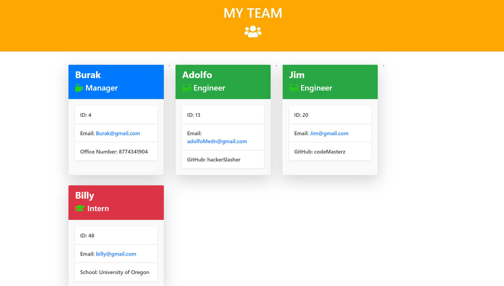

# Team-Generator

Software engineering Node command line app team generator which creates a HTML file based on inputs and prompts showcasing your employees you created for a team.
- The first employee you create is the Manager which is required and can only be one.
- From there you can create as many Engineers/Interns you want.
- Once done, the team.HTML file will be generated in the output folder in the repo.

**How To Use:**

    1. Clone repository
    2. Run your terminal/CMD with the path set for cloned repository folder
    3. In the terminal, run the command: npm install (a new folder should appear in the repo named node_modules)
    4. Run the command: node app.js
    5. Go through the prompts and complete.

___________________________________________________________________________________________________________________________________

**The HTML displays:**

- Name
- Role
- ID
- Email
- Specifics

___________________________________________________________________________________________________________________________________

